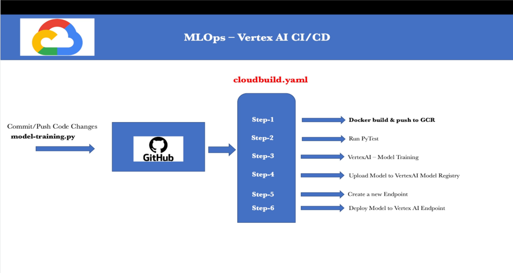
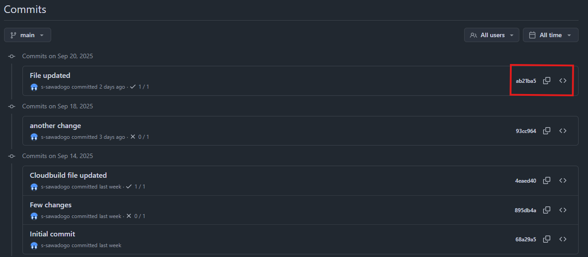
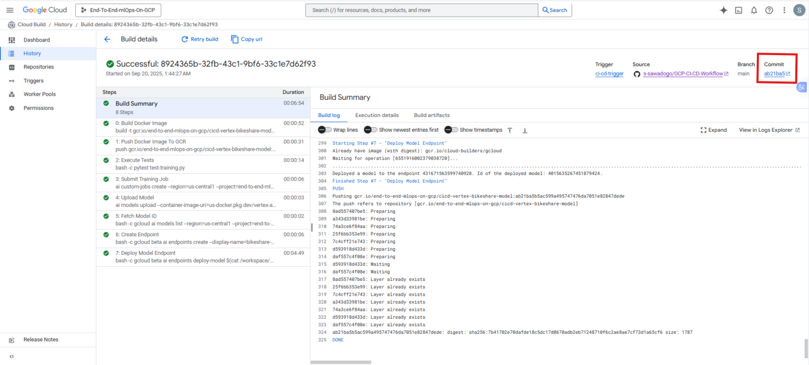

# A CI/CD pipeline for a GCP Machine Learning workflow

## 🎯 Overview

**This is a CI/CD pipeline for running Machine Learning (ML) in GCP Vertex AI. It allow the automatic execution on the entire ML pipeline from the training ans testing stages to the deployment of the ML model to en endpoint without any manual intervention.**

**The CI/CD process uses GitHub commits as triggers. Once a new commit has been pushed to the GitHub repository, it automaticly trigger the ML workflow in GCP as shown below.**


## 🏗️ Key steps
1. **Building a Docker Image**
2. **Pushing the Docker Image To Google Container Registry (GCR)**
3. **Executing unit testing (PyTest)**
4. **Submitting the Training Job**
5. **Storing the trained model in a GCS bucket (Model Artifact)**
6. **Uploading the Model from GCS bucket to Vertex AI Model Registry**
7. **Creating a model Endpoint**
8. **Deploying the  Model to the created Vertex AI Endpoint**

### The entire worflow is shown below :




### Once a new commit is pushed to the Github repository,...




### It triggers the ML workflow in GCP as shown below :




## 📦 How to use this project :


1. ### Clone first this repository to your local machine

````bash
git clone https://github.com/s-sawadogo/GCP-CI-CD-Workflow.git
````

2. ### Create your GCP project and connect it to your GitHub repository by following this tutorial :


#### https://cloud.google.com/build/docs/automating-builds/create-manage-triggers?hl=fr


## 🛠️ Stack (Tools)

1. **Python**
2. **VS Code**
3. **Google Cloud Platform (GCP)**
4. **Vertex AI**
5. **Cloud Build**
6. **Git**
7. **GitHub**